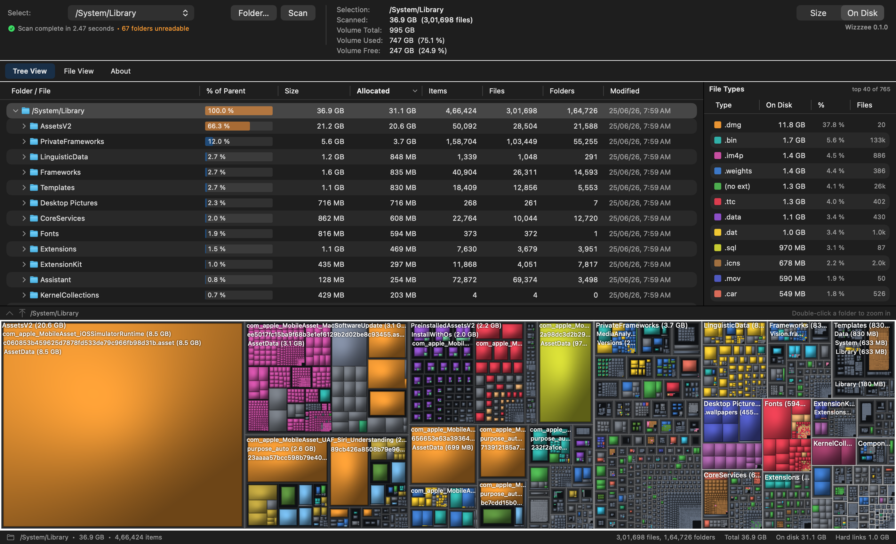
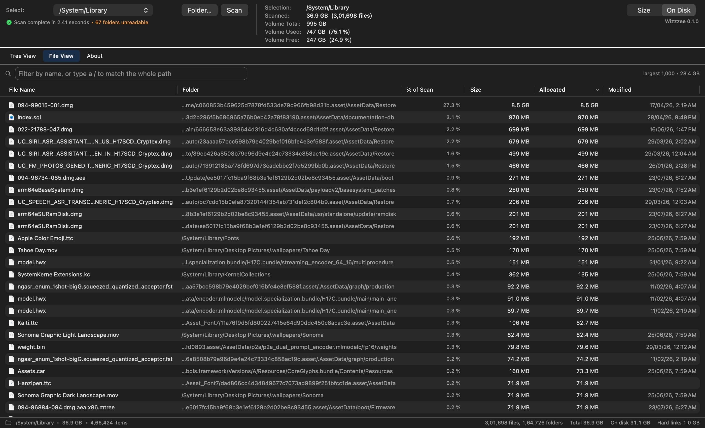
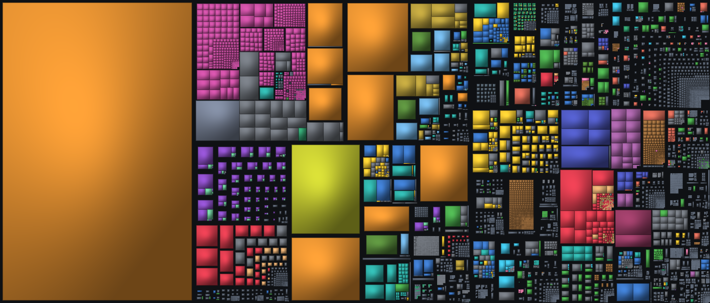

# Wizzzee

A disk space analyzer for macOS, in the shape of [WizTree](https://diskanalyzer.com/):
a folder tree with sizes, a list of the biggest files, and a colored treemap you
can click into. It scans everything it is allowed to read — system files, hidden
files, caches, other users' folders — and can trash or delete what you pick.

Scans the whole startup disk (about 3.9M files) in roughly 15 seconds.



## Install a release

Download the latest `Wizzzee-<version>-macos-universal.zip` and
`SHA256SUMS.txt` from [Releases](https://github.com/SaiBarathR/wizzzee/releases),
then:

```bash
shasum -a 256 -c SHA256SUMS.txt
```

Unzip, move `Wizzzee.app` to Applications, then Control-click it and choose
**Open** — the app is ad-hoc signed rather than notarized, so macOS asks once.

The app is universal (`arm64` + `x86_64`) and needs macOS 14 or newer.

## Build from source

Needs the Xcode command line tools; no Xcode project, no dependencies.

```bash
./scripts/build-app.sh --install
```

That builds `dist/Wizzzee.app` as a universal binary, ad-hoc signs it, and
copies it to `/Applications`. Leave off `--install` to just build into `dist/`,
or add `--native` to skip the second architecture while iterating.

```bash
open dist/Wizzzee.app
```

## Full Disk Access

Without it, macOS hides Mail, Messages, Safari, Time Machine and other users'
home folders, and the totals read low — the header says so when it detects this.
To grant it:

**System Settings → Privacy & Security → Full Disk Access → +** and add
`Wizzzee.app`.

One wrinkle: the app is ad-hoc signed, because a real signature needs a paid
Apple Developer account. macOS ties the permission to the exact binary, so
**every rebuild drops the grant** and you have to re-add it. If that gets
annoying, install once and leave it alone, or remove and re-add the entry after
rebuilding.

## Using it

- **Tree View** — folder hierarchy, sorted by size. Click a column to re-sort;
  sorting applies within each parent, so the hierarchy stays intact.
- **File View** — the 1,000 biggest files anywhere in the scan. Type in the
  filter to search by name; include a `/` to match against the full path.
- **Treemap** — every file as a rectangle, area proportional to size, colored by
  extension. Click to select, double-click a folder to zoom in, and use the
  arrows in the strip above it to zoom back out. **View ▸ Hide Treemap** gives
  the whole tab to the table; showing it again keeps the zoom you left it at.
- **Right-click anything** for Reveal in Finder, Open, Open in Terminal, Copy
  Path, Move to Trash, or Delete Permanently. Deleting updates the sizes all the
  way up the tree without rescanning.

| Shortcut | Action |
| --- | --- |
| `Return` | Scan |
| `⌘.` | Stop a running scan |
| `⌘R` | Rescan |
| `⌘T` | Show or hide the treemap |
| `⌘[` | Zoom the treemap out |
| `⌘0` | Reset the treemap zoom |



## Reading the numbers

**Size vs On Disk.** "Size" is the logical file length; "On Disk" is the space
actually allocated. They diverge enormously for sparse files — an OrbStack disk
image on this machine reports 996 GB but occupies 42 GB. The app defaults to
**On Disk**, since that is the space you get back by deleting something. The
toggle is in the top right.

**Base-10 units.** 1 GB is 1,000,000,000 bytes, matching Finder and Get Info.
Note this differs from `df -h`, which is base-2, and from WizTree on Windows,
which labels base-2 units "GB".

**Hard links are counted once.** The status bar shows how much would have been
double-counted otherwise. Which of the linked names is the one shown is
arbitrary — whichever the scanner reaches first.

**One volume per scan.** Other disks, network shares and the synthetic mounts
under `/System/Volumes` are left out. APFS firmlinks are followed once, so
`/Users` is counted but `/System/Volumes/Data/Users` — the same directory by
another path — is not.

**Totals won't exactly match `df`.** Unreadable folders, APFS snapshots and
filesystem metadata account for the difference. The header reports how many
folders it could not read.

## What can't be deleted

`/System`, `/usr`, `/bin`, `/sbin` are on the sealed system volume, which System
Integrity Protection makes read-only. Nothing can remove files there — not even
an administrator. Wizzzee still shows them so the space is accounted for, and
says so instead of failing with a bare permission error.

## Command line

Useful for scripting, and how the engine gets verified without the UI.

```bash
Wizzzee --scan ~/Library              # totals, biggest folders/files/types
Wizzzee --probe /some/dir             # raw getattrlistbulk attributes
Wizzzee --treemap / out.png           # render a treemap straight to a PNG
Wizzzee --selftest                    # check the scanner and the delete paths
Wizzzee --uishot --out ui.png         # screenshot the UI from inside the process
```

`--scan` totals match `du -sk` exactly on the trees they were compared against.
Full flag reference in [docs/cli.md](docs/cli.md).

## How the scan is fast

WizTree's trick on Windows is reading the NTFS master file table directly. APFS
has no equivalent public index, so the approach here is different:

- **`getattrlistbulk(2)`** returns names, types, sizes, dates and link counts for
  many directory entries per syscall, instead of a `stat` per file.
- **A worker thread per core** pulls from a shared stack of pending directories,
  which keeps an SSD saturated (about 980% CPU on an 18-core machine).
- **Sizes are summed in one pass afterwards**, so the parallel phase needs no
  locks beyond the progress counters.
- **Files live in a packed array on their parent folder** rather than as
  individual objects, which keeps a 4M-file scan in a few hundred MB.

The treemap is a squarified layout with van Wijk cushion shading, rasterized per
pixel — the tiles tile the canvas, so a full render costs about one pass over the
bitmap no matter how many files there are.



The full write-up is in [docs/architecture.md](docs/architecture.md).

## Layout

```
Sources/Wizzzee/
  Core/       BulkEnumerator (getattrlistbulk), ScanEngine, ScanTree,
              Volumes, FileActions, Formatting
  Treemap/    TreemapLayout (squarify + cushions), TreemapRenderer, TreemapView
  UI/         ContentView, HeaderBar, TreeViewTab, FileViewTab, TreemapPane,
              StatusBar
  App/        Main, WizzzeeApp, AppModel, AppInfo, CLI, SelfTest, UIShot
scripts/      build-app.sh, validate-release.sh, make-icon.swift
docs/         architecture.md, cli.md, releasing.md, releases/
```

## Verify a build

```bash
./scripts/build-app.sh
dist/Wizzzee.app/Contents/MacOS/Wizzzee --selftest
```

`--selftest` builds a throwaway tree with known contents and checks the scanner
and both delete paths against ground truth — 37 checks, no permissions needed.
CI runs it on every push, along with a universal-binary and signature check.

## Releasing

Tagging `v*` builds, verifies and publishes a release from GitHub Actions. The
process and what it checks are in [docs/releasing.md](docs/releasing.md).

## Privacy

Wizzzee reads your filesystem and shows you what it found. It makes no network
requests, has no analytics, and writes nothing outside the files you explicitly
delete.

## License

[MIT](LICENSE).
