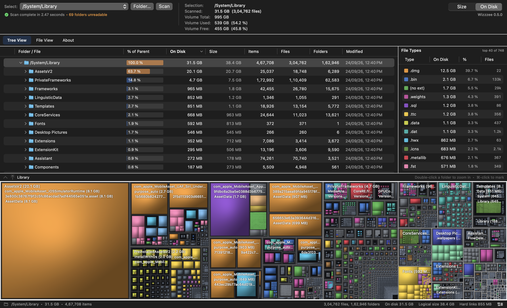
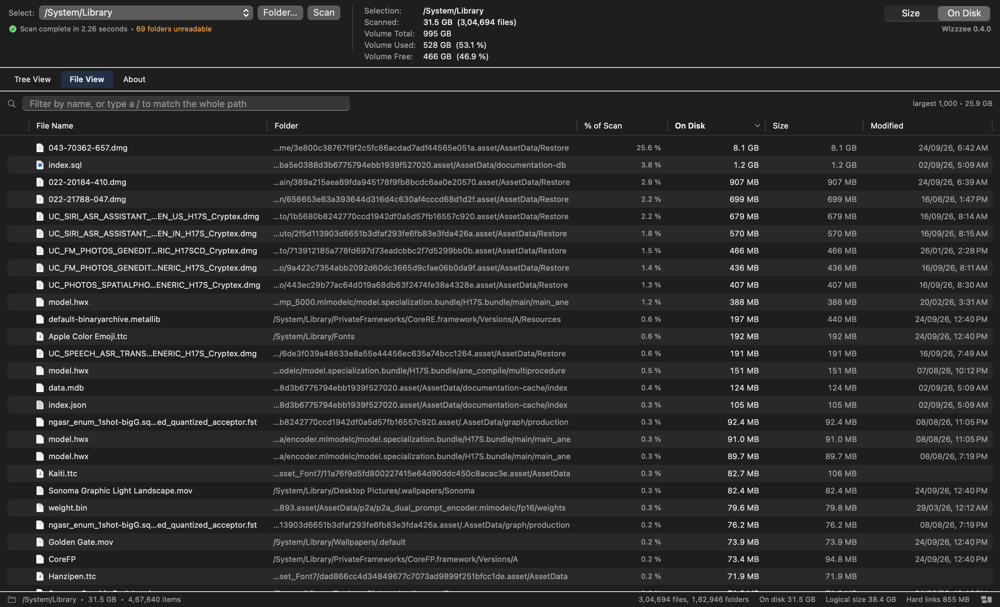
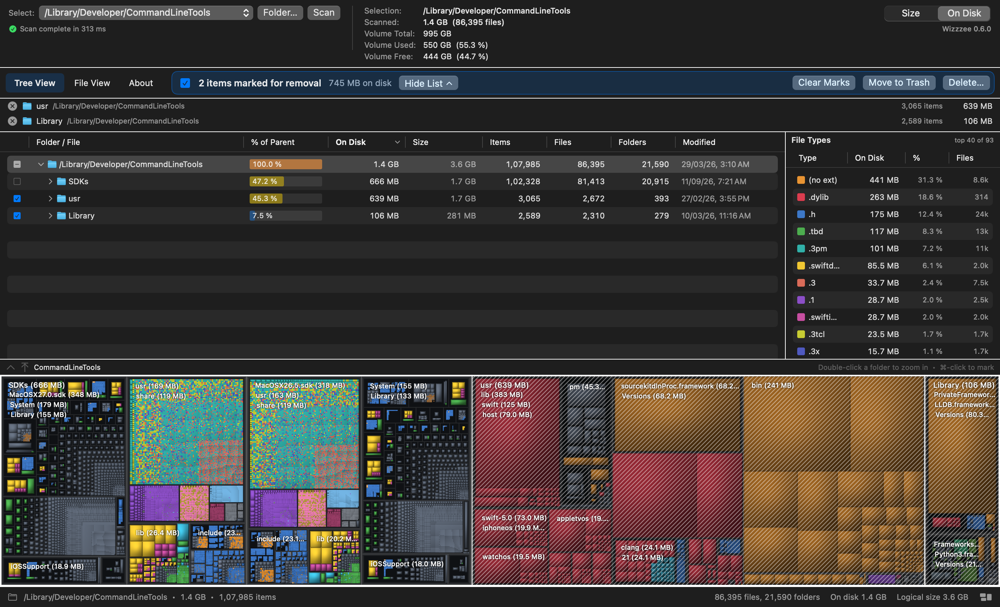
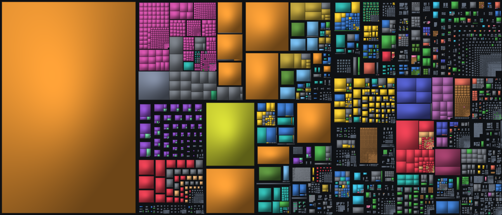

# Wizzzee

A disk space analyzer for macOS, in the shape of [WizTree](https://diskanalyzer.com/):
a folder tree with sizes, a list of the biggest files, and a colored treemap you
can click into. It scans everything it is allowed to read — system files, hidden
files, caches, other users' folders — and can trash or delete what you pick.

Scans the whole startup disk (about 3.9M files) in roughly 15 seconds.



## Install a release

Download the latest `Wizzzee-<version>-macos-universal.zip` and
`SHA256SUMS.txt` from [Releases](https://github.com/SaiBarathR/wizzzee/releases),
then:

```bash
shasum -a 256 -c SHA256SUMS.txt
```

Unzip and move `Wizzzee.app` to Applications. The app is ad-hoc signed rather
than notarized, so Gatekeeper blocks the first launch: open it once, dismiss the
warning, then go to **System Settings → Privacy & Security** and click **Open
Anyway** next to the message about Wizzzee. macOS asks only that once.

On macOS 14 you can instead Control-click the app and choose **Open**; macOS 15
removed that shortcut for apps that aren't notarized.

The app is universal (`arm64` + `x86_64`) and needs macOS 14 or newer.

## Build from source

Needs the Xcode command line tools; no Xcode project, no dependencies.

```bash
./scripts/build-app.sh --install
```

That builds `dist/Wizzzee.app` as a universal binary, ad-hoc signs it, and
copies it to `/Applications`. Leave off `--install` to just build into `dist/`,
or add `--native` to skip the second architecture while iterating.

```bash
open dist/Wizzzee.app
```

## Full Disk Access

Without it, macOS hides Mail, Messages, Safari, Time Machine and other users'
home folders, and the totals read low — the header says so when it detects this.
To grant it:

**System Settings → Privacy & Security → Full Disk Access → +** and add
`Wizzzee.app`.

One wrinkle: the app is ad-hoc signed, because a real signature needs a paid
Apple Developer account. macOS ties the permission to the exact binary, so
**every rebuild drops the grant** and you have to re-add it. If that gets
annoying, install once and leave it alone, or remove and re-add the entry after
rebuilding.

## Using it

- **Tree View** — folder hierarchy, sorted by size. Click a column to re-sort;
  sorting applies within each parent, so the hierarchy stays intact. `→` opens
  the selected folder and `←` shuts it, as in Finder's list view; pressed again
  they step into the folder and back out of it.
- **File View** — the 1,000 biggest files anywhere in the scan, and where to
  search it. `⌘F` goes to its filter from any tab. Words are looked for in
  names — all of them, in any order — and find folders as well as files, so
  `node_modules` lists every folder of that name and what they come to. A word
  with a `/` in it is looked for in the whole path, and `"two words"` in quotes
  are one. The rest are filters:

  | Filter | Finds |
  | --- | --- |
  | `>1gb` `<500kb` | what is bigger, or smaller, in the measure on show |
  | `older:1y` `newer:30d` | by when it was last modified (`d`, `w`, `m`, `y`) |
  | `ext:dmg` | one file type; `ext:none` for files with no extension |
  | `kind:folder` `kind:file` | folders only, or files only |

  A second filter of a kind narrows the first, as a second word does. The
  line at the right says how many things matched, listed or not, and what
  they take up; a match inside a folder that also matched is counted and adds
  nothing to the size. `Esc` empties the filter.
- **Treemap** — every file as a rectangle, area proportional to size, colored by
  extension. Click to select, double-click a folder to zoom in, and click any
  folder in the path above it to zoom back out to there. **View ▸ Hide Treemap**, or the
  button at the right-hand end of the status bar, gives the whole tab to the
  table; showing it again keeps the zoom you left it at, and whichever way you
  leave it is how it opens next launch.
- **File Types** — the list beside the tree ranks the scan by file extension.
  Click a type to put it in focus: its tiles stay lit on the treemap while every
  other tile is set back, and File View lists that type's largest files and no
  others. A label naming the type appears beside the map and above the file
  list; click it to take the focus off, or press `Esc` in the list. The list
  starts at the 40 largest types — click **top 40 of …** in its heading for all
  of them.
- **`⌘Y` opens Quick Look** on the selected item, and shuts it again — so what
  a file is can be seen before deciding what to do with it. While it is open it
  shows the one thing selected: it follows the selection, shuts when several
  rows are selected, and when the item on show is removed it moves on to
  whatever took its place, so a list can be worked down with it up. Opened from
  the right-click menu, it selects the row it shows. A file that
  is *online only* is not previewed: that would download it.
- **Right-click anything** for Reveal in Finder, Open, Quick Look, Open in
  Terminal, Copy Path, Move to Trash, or Delete Permanently. Deleting updates the sizes all the
  way up the tree without rescanning: the row goes, its neighbours stay where
  they were, and the selection moves to whatever took its place. A delete that
  takes a while shows how many items and how much space have gone in the status
  bar, and **Stop** there ends it part-way — what is left stays in the tree,
  measured as it now is.
- **Mark things to remove them together.** The box at the start of each row
  marks it, and so do `Space` on a selected row, `⌘`-click on a treemap tile,
  and **Mark for Removal** in the right-click menu. A mark is not the
  selection: it stays put while you open other folders, sort, filter or switch
  tabs, so you can gather items from anywhere in the scan. Marking a folder
  marks everything in it, and a folder with something marked inside shows a
  dash. The status bar counts what is marked and what removing it would free;
  click that to open the list, which gives each item's size, lets you take a
  mark back off, and has **Move to Trash** and **Delete…** for the lot. Marked
  tiles are hatched on the treemap.
- **A rescan keeps your place.** `⌘R`, or Scan on the folder already on show,
  brings the figures up to date and leaves the window as it was: the same
  folders open, the map zoomed to the same folder, the same selection and the
  same marks, wherever those things are still there. A mark whose item has
  gone is counted beside "Scan complete", so a shorter list is not taken for
  the whole of it. A scan of somewhere else starts afresh.
- **`⌘⌫` and `⌥⌘⌫`** do what they do in Finder, to whatever is selected: the
  first moves it to the Trash straight away, the second asks and then deletes it
  for good. They act only on a selection you can see — a row in the tab in
  front, or the tile outlined on the treemap — and leave `⌘⌫` to the File View
  filter while you are typing in it.

| Shortcut | Action |
| --- | --- |
| `Return` | Scan |
| `⌘O` | Choose a folder to scan |
| `⌘.` | Stop a running scan |
| `⌘R` | Rescan |
| `⌘F` | Search: go to the File View's filter |
| `⌘Y` | Quick Look at the selected item, or shut it |
| `Space` or `⇧⌘M` | Mark the selected rows for removal, or unmark them |
| `⌘⌫` | Move the selection to the Trash |
| `⌥⌘⌫` | Delete the selection permanently, after confirming |
| `⌘1` `⌘2` `⌘3` | Tree View, File View, About |
| `→` `←` | Open or shut the selected folder; again, step into it or out of it |
| `⌘T` | Show or hide the treemap |
| `⌘[` | Zoom the treemap out |
| `⌘0` | Reset the treemap zoom |





## Reading the numbers

**Size vs On Disk.** "Size" is the logical file length; "On Disk" is the space
actually allocated. They diverge enormously for sparse files — an OrbStack disk
image on this machine reports 996 GB but occupies 42 GB, on a 995 GB disk. The
app defaults to **On Disk**, since that is the space you get back by deleting
something. The toggle is in the top right, and the next launch starts with
whichever was chosen — as it does with the volume or folder last scanned.

Whichever is on show is what the window reports: the header's **Scanned** line,
the status bar, the bars and the treemap. The tables show both, **On Disk**
first, with the one that is not on show set back. A file with stretches that
were never written is marked **sparse** — or **online only**, when a cloud
provider is holding its contents — and hovering the mark gives both figures.
Compressed files occupy less than their length too, as most of the system's
own do, but nothing of theirs is missing and they are left unmarked.

Lengths added up can come to more than the disk holds; a single sparse image
does it. That sum is the status bar's **Logical size**, and it is why a length
is never quoted on its own next to the volume's capacity.

**Base-10 units.** 1 GB is 1,000,000,000 bytes, matching Finder and Get Info.
Note this differs from `df -h`, which is base-2, and from WizTree on Windows,
which labels base-2 units "GB".

**Hard links are counted once.** The status bar shows how much would have been
double-counted otherwise. Which of the linked names is the one shown is
arbitrary — whichever the scanner reaches first. An analyzer that counts every
name in full reports a folder of hard links — a package store, a developer
cache — as larger than Wizzzee and `du` do.

**One volume per scan.** Other disks, network shares and the synthetic mounts
under `/System/Volumes` are left out. APFS firmlinks are followed once, so
`/Users` is counted but `/System/Volumes/Data/Users` — the same directory by
another path — is not.

**Totals won't exactly match `df`.** Unreadable folders, APFS snapshots and
filesystem metadata account for the difference. The header reports how many
folders it could not read.

## What can't be deleted

`/System`, `/usr`, `/bin`, `/sbin` are on the sealed system volume, which System
Integrity Protection makes read-only. Nothing can remove files there — not even
an administrator. Wizzzee still shows them so the space is accounted for, and
says so instead of failing with a bare permission error.

## Command line

Useful for scripting, and how the engine gets verified without the UI.

```bash
Wizzzee --scan ~/Library              # totals, biggest folders/files/types
Wizzzee --probe /some/dir             # raw getattrlistbulk attributes
Wizzzee --treemap / out.png           # render a treemap straight to a PNG
Wizzzee --selftest                    # check the scanner and the delete paths
Wizzzee --uishot --out ui.png         # screenshot the UI from inside the process
Wizzzee --prefs                       # print the preferences the app reads
```

`--scan` totals match `du -sk` exactly on the trees they were compared against.
Full flag reference in [docs/cli.md](docs/cli.md).

## How the scan is fast

WizTree's trick on Windows is reading the NTFS master file table directly. APFS
has no equivalent public index, so the approach here is different:

- **`getattrlistbulk(2)`** returns names, types, sizes, dates and link counts for
  many directory entries per syscall, instead of a `stat` per file.
- **A worker thread per core** pulls from a shared stack of pending directories,
  which keeps an SSD saturated (about 980% CPU on an 18-core machine).
- **Sizes are summed in one pass afterwards**, so the parallel phase needs no
  locks beyond the progress counters.
- **Files live in a packed array on their parent folder** rather than as
  individual objects, which keeps a 4M-file scan in a few hundred MB.

The treemap is a squarified layout with van Wijk cushion shading, rasterized per
pixel — the tiles tile the canvas, so a full render costs about one pass over the
bitmap no matter how many files there are.



The full write-up is in [docs/architecture.md](docs/architecture.md).

## Layout

```
Sources/Wizzzee/
  Core/       BulkEnumerator (getattrlistbulk), ScanEngine, ScanTree,
              Volumes, FileActions, Formatting
  Treemap/    TreemapLayout (squarify + cushions), TreemapRenderer, TreemapView
  UI/         ContentView, HeaderBar, TreeViewTab, FileViewTab, TreemapPane,
              StatusBar
  App/        Main, WizzzeeApp, AppModel, AppInfo, CLI, SelfTest, UIShot
scripts/      build-app.sh, validate-release.sh, make-icon.swift
docs/         architecture.md, cli.md, releasing.md, releases/
```

## Verify a build

```bash
./scripts/build-app.sh
dist/Wizzzee.app/Contents/MacOS/Wizzzee --selftest
```

`--selftest` builds a throwaway tree with known contents and checks the scanner
and both delete paths against ground truth — 402 checks, no permissions needed.
CI runs it on every push, along with a universal-binary and signature check.

## Releasing

Tagging `v*` builds, verifies and publishes a release from GitHub Actions. The
process and what it checks are in [docs/releasing.md](docs/releasing.md).

## Privacy

Wizzzee reads your filesystem and shows you what it found. It makes no network
requests, has no analytics, and writes nothing outside the files you explicitly
delete.

## License

[MIT](LICENSE).
